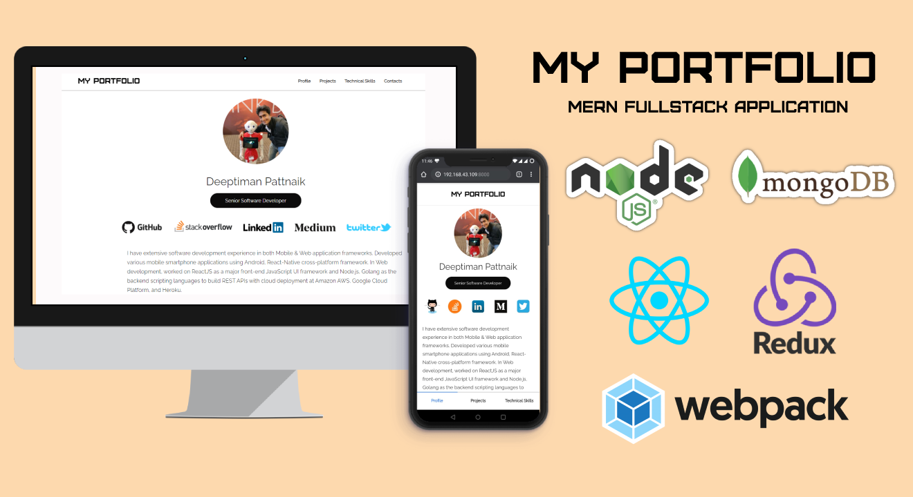

# My Portfolio

My Portfolio is a **MERN** based Full-Stack web application where users can see all the projects that I have completed as a Professional Software Developer. The web application developed using **Node.js** as backend service, **MongoDB** as cloud database and **ReactJS** as a front-end framework and **Webpack** as a module bundler.



### MongoDB Import

    git clone https://github.com/Deeptiman/react-myportfolio
    cd reactjs-myportfolio/database
    mongoimport --uri "mongodb://127.0.0.1:27017/poccoder_portfolio" --collection projects --jsonArray --file projects.json
    
### Installation
```
cd reactjs-myportfolio

npm install
npm run start
```
Then, type "http://localhost:9004" in the browser

### Follow me
<a href="https://twitter.com/deeptimancode" target="_blank"></a>

<h2>License</h2>
<p>This project is licensed under the <a href="https://github.com/Deeptiman/react-myportfolio/blob/master/LICENSE">MIT License</a></p>

